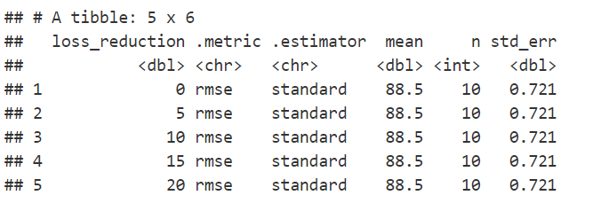

```{r setup, include=FALSE}
knitr::opts_chunk$set(eval = FALSE, echo = TRUE)

library(tidymodels)
library(skimr)
library(doParallel)
library(tictoc)
library(vip)
library(xgboost)
library(rio)
library(Cairo)
library(here)
library(utils)
```

# Some background on boosted trees:

For our third model, we decided to conduct a boosted trees regression model. This builds upon basic decision trees, which recursively split data into binary and homogeneous subgroups until reaching an optimum point in which the nodes cannot be split further. Each subgroup is split into what the algorithm thinks is the “best,” based on running all other possible splits on all variables. 

To improve upon decision trees, ensemble methods aggregate across multiple decision trees in order to develop better models and predictions. Boosted trees (the ensemble method we are using) work by fitting multiple decision trees sequentially to the residuals of the previous model until reaching a stopping rule that ends the sequential model fitting. Although boosted trees mostly consist of “stumps,” or short trees with little data in each individual model, their ensemble output typically achieves high “out-of-the-box” performance, which is why we chose it for our final fit.

An important aspect of boosted trees is gradient descent, which is an optimization algorithm that compares predictions against a cost function to determine how steep the sequential models descend to reach the designated stopping point. For us, this stopping point will be the minimum value of RSME. The steepness of the descent is determined by the learning rate, or the size of steps we take at each model iteration.

# Important hyperparameters to tune:

* **Learning rate** : the size of step we take at each model iteration as we descend to the best minimum value during gradient descent. 
   + Typically ranges from .001 to .3, but can range from 0 to 1. 
   + Smaller values help avoid overfitting and have a greater chance of achieving “optimal” accuracy, but are more computationally intensive.
* **Tree depth** : how many splits we conduct, this is typically low in boosted trees, which helps reduce overfitting.
* **Number of trees** : the number of trees we fit. Too few leads to ting, whuile too many leads to overfitting.
* **Minimum n for a terminal node** : the number of splits before reaching an end node of the tree.

You can also tune **loss reduction**, which specifies minimum loss required for further trees based on each prior tree's complexity, and **randomization**.

# Overview of the steps in our boosted tree:

1. Tune the learning rate between the optimum values of .005 to .3.
2. Tune again using a lower learning rate range, since our optimum value from the first model was relatively small.
3. Select the best learning rate, then tune tree depth and minimum n at that rate.
4. Select optimum tree depth and minimum n, then tune loss reduction.
5. Tune model for randomness using mtry and sample size. 
   + As loss reduction had no impact on the model, we do not use output from that model.
6. Select the best model based on randomness and develop predictions for our test data.

# Lets look at the code!

### Splitting the data

First, we split the training file of the overall data into training and testing sets and set-up cross validation. Not shown below is that we are using only 5% of the training data, as it took too long for our model to run otherwise. This can be done by adding "sample_frac(.05)" when reading the data in (even with 5%, all these models took almost 8 hours to run!).

```{r splitting data}
splt <- initial_split(data)
train <- training(splt)
cv <- vfold_cv(train)
```

### Writing the recipe

Second, we write our recipe. This is the same as previous recipes used in prior models, see Preliminary Fit 1 for more information.

```{r recipe}
rec <- recipe(score ~ ., train) %>% 
  step_mutate(tst_dt = as.numeric(lubridate::mdy_hms(tst_dt))) %>% 
  update_role(contains("id"), ncessch, new_role = "id vars") %>% 
  step_nzv(all_predictors(), freq_cut = 0, unique_cut = 0) %>% 
  step_novel(all_nominal()) %>% 
  step_unknown(all_nominal()) %>% 
  step_medianimpute(all_numeric(), -all_outcomes(), -has_role("id vars"))  %>% 
  step_dummy(all_nominal(), -has_role("id vars")) %>% 
  step_nzv(all_predictors())
```

### Setting up the model

Third, we set-up our model. For boosted trees, we are using the "xgboost" engine. We use "set_mode" to tell our model that we are running a regression.

```{r model}
mod <- boost_tree() %>% 
  set_engine("xgboost", nthreads = parallel::detectCores()) %>% 
  set_mode("regression") 

```

### Adding recipe and model to a workflow

We then add our model to a workflow. This will be helpful as we change our model by tuning different hyperparameters throughout the model fitting process, as we can simply update this workflow with that information as opposed to starting from scratch.

```{r workflow}
wf_df <- workflow() %>% 
  add_recipe(rec) %>% 
  add_model(mod)
```

### Tuning the learning rate between the optimum values of .005 to .3.

In this model, we set our number of trees at 6000, stop iterations at 20, and validation at 0.2. We picked a large number of trees because boosted trees are shallow models, so, to get a better fit, they need a larger number trees. 

We started tuning between .005 to .3 because smaller learning rates are seen as better and this range is a suggested starting point. You can see that we established tuning by telling our model that "learn_rate" is set to "tune()" and then providing the tuning range through "expand.grid."

We can then run our first model! You can see how long the model takes by adding "tic()" and "toc()" around the model. This model took 6078.83 seconds.

```{r model2}
tune_lr <- mod %>% 
  set_args(trees = 6000,
           learn_rate = tune(),
           stop_iter = 20,
           validation = 0.2)

wf_tune_lr <- wf_df %>% 
  update_model(tune_lr)

grd <- expand.grid(learn_rate = seq(0.005, 0.3, length.out = 15))

tic()
tune_tree_lr <- tune_grid(wf_tune_lr, cv, grid = grd, control = tune::control_resamples(verbose = TRUE, save_pred = TRUE))
toc()
```

Then we looked at the output and found the best value from the model. We assessed "best" by looking for the lowest RSME score, which was 91.5 in this model at a learning rate of 0.005.

```{r metrics fit2}
collect_metrics(tune_tree_lr)

show_best(tune_tree_lr, "rmse")
```

```{r first learn rate output, echo = FALSE, eval = TRUE, out.width = '100%'}

```

We decided to plot this output to see if we need to tune learning rate again. After looking at the plot, we decided to try an even smaller learning rate, as our best value was at the bottom of the range we used.

```{r plot}
to_plot <- tune_tree_lr %>% 
  unnest(.metrics) %>% 
  group_by(.metric, learn_rate) %>% 
  summarize(mean = mean(.estimate, na.rm = TRUE)) %>% 
  filter(learn_rate != 0.0001) 

highlight <- to_plot %>% 
  filter(.metric == "rmse" & mean == min(mean)) %>%
  ungroup() %>% 
  select(learn_rate) %>% 
  semi_join(to_plot, .)

ggplot(to_plot, aes(learn_rate, mean)) +
  geom_point() +
  geom_point(color = "#de4f69", data = highlight) +
  facet_wrap(~.metric, scales = "free_y") +
  theme_minimal() +
  labs(title = "RSME and RSQ after tuning learning rate",
       subtitle = "Best learning rate indicated by red point",
       x = "Learn rate",
       y = "Mean")

```

```{r learn rate plot, echo = FALSE, eval = TRUE, out.width = '100%'}

```

### Tuning again using a lower learning rate range

The code below is very similar to the last model, with the only difference being that we lowered our range in expand.grid for learning rate to vary between 0.0001 to 0.1.

```{r find best learn rate}
tune_lr2 <- mod %>% 
  set_args(trees = 6000,
           learn_rate = tune(),
           stop_iter = 20,
           validation = 0.2)

wf_tune_lr <- wf_df %>% 
  update_model(tune_lr2)

grd <- expand.grid(learn_rate = seq(0.0001, 0.1, length.out = 15))

tic()
tune_tree_lr2 <- tune_grid(wf_tune_lr, cv, grid = grd, control = tune::control_resamples(verbose = TRUE, save_pred = TRUE))
toc()
```

This model took 5720.34 seconds to run. The results below demonstrate that this did not result in a better RSME score, with the lowest score being 93.0 at a learning rate of .00724. Therefore, we decided to build the next model using the learning rate that lead to the lowest RSME score in the previous fit.

```{r metrics fit3}
collect_metrics(tune_tree_lr2)

show_best(tune_tree_lr2, "rmse")
```

```{r second learn rate output, echo = FALSE, eval = TRUE, out.width = '100%'}
knitr::include_graphics("lr2 white back.png")
```

### Tuning tree depth and minimum n

In the code below, you can see that we told our model to use the learning rate that lead to the best RSME in our first model using this code: 

finalize_model(select_best(tune_tree_lr, "rmse"))

We then set "tree_depth" and "min_n" to tune and updated our workflow. To tune both values, we used default ranges in tree_depth and min_n, but told "grid_max_entropy" to pick 30 of those values per fold.

```{r tuning tree depth}
tune_depth <- tune_lr %>% 
  finalize_model(select_best(tune_tree_lr, "rmse")) %>% 
  set_args(tree_depth = tune(),
           min_n = tune())

wf_tune_depth <- wf_df %>% 
  update_model(tune_depth)

grd <- grid_max_entropy(tree_depth(), min_n(), size = 30)

tic()
tune_tree_depth <- tune_grid(wf_tune_depth, cv, grid = grd, control = tune::control_resamples(verbose = TRUE, save_pred = TRUE))
toc()
```

In the following results, you can see the best RSME was 87.7 at a tree depth of 2 and minimum n of 14. This model took 15551.17 seconds to run, over 4 hours!

*Note: We had to re-run these results because we forgot to take a screenshot of our previous tree depth model results after the first 8 hour run. In those results, the best model had an n of 38 and a depth of 1 and an RSME somewhere in 88. We based the following randomness model on that tree depth of 1. We re-ran these results overnight and did not see the difference until the entire analysis was completed. If we had, we would have continued with this model informing our randomness model and (as you will see later) as our overall best model.*

```{r metrics fit4}
collect_metrics(tune_tree_depth)

show_best(tune_tree_depth, "rmse")
```

```{r tree depth output, echo = FALSE, eval = TRUE, out.width = '100%'}

```

### Tuning loss reduction

We then decided to tune loss reduction by again setting that parameter to tune within the the set_args() function of the model and defined the range in expand.grid to be from 0 to 100 with intervals of 5. We took the best parameters from the last model, but manually set tree_depth to 1 based on a prior model we had run (see note after tree depth model for explanation).

```{r}
tune_loss <- tune_depth %>% 
  finalize_model(select_best(tune_tree_depth, "rmse")) %>% 
  set_args(loss_reduction = tune(),
           tree_depth = 1)

wf_tune_reg <- wf_df %>% 
  update_model(tune_loss)

grd <- expand.grid(loss_reduction = seq(0, 100, 5))

tic()
tune_tree_reg <- tune_grid(wf_tune_reg, cv, grid = grd, control = tune::control_resamples(verbose = TRUE, save_pred = TRUE))
toc()

```

As can be seen in the output below, tuning loss reduction actually worsened the results. Thus, we decided to ignore this model and do the next model using the best output from when we tuned tree depth and minimum n. This model took 1581.2 seconds.

```{r metrics loss model}
collect_metrics(tune_tree_reg)

show_best(tune_tree_reg, "rmse")

# no improvement on last model
```

```{r loss reduction output, echo = FALSE, eval = TRUE, out.width = '100%'}

```

### Tuning randomness using mtry and sample_size

We selected the best parameters from when we tuned tree depth and minimum n, then tuned randomness by setting mtry and sample_size to tune() and using grid_max_entropy to define this tuning. By using finalize with mtry, mtry will automatically look at all our predictors because we are finalizing it with our recipe and data. We then tell sample_size that we only want it to look at proportion.

```{r tuning randomness}
tune_rand <- tune_loss %>%
  finalize_model(select_best(tune_tree_reg, "rmse")) %>% 
  set_args(mtry = tune(),
           sample_size = tune())

wf_tune_rand <- wf_df %>% 
  update_model(tune_rand)

grd <- grid_max_entropy(finalize(mtry(), juice(prep(rec))), 
                        sample_size = sample_prop(), 
                        size = 30)

tic()
tune_tree_rand <- tune_grid(wf_tune_rand, cv, grid = grd,control = tune::control_resamples(verbose = TRUE, save_pred = TRUE))
toc()
```

This model took 2683.02 seconds to run. The below code showed that the best model had an RSME of 88.2 at an mtry of 23 and a sample_size of 0.217. Due to the fact that this model lead to our best results on our first run through with 5% of the data, we used this data for our predictions (see note under loss reduction for more explanation).

```{r metrics randomness model}
collect_metrics(tune_tree_rand)

show_best(tune_tree_rand, "rmse")
```

```{r randomness output, echo = FALSE, eval = TRUE, out.width = '100%'}

```

You can see the output of this tuning model in the below plot, with the best values plotted in red.

```{r randomness plot} 
to_plot_rand <- tune_tree_rand %>% 
  unnest(.metrics) %>% 
  group_by(.metric, mtry, sample_size) %>% 
  summarize(mean = mean(.estimate, na.rm = TRUE)) %>% 
  filter(.metric == "rmse") %>%
  ungroup() %>% 
  pivot_longer(cols = c(mtry, sample_size), 
               names_to = "tuning_param", 
               values_to = "tuning_val")

highlight_rand <- to_plot_rand %>% 
  filter(mean == min(mean))
  
ggplot(to_plot_rand, aes(tuning_val, mean)) +
  geom_point() +
  geom_point(color = "#de4f69", data = highlight_rand) +
  facet_wrap(~tuning_param) +
  labs(title = "Mean RSME after tuning randomness using mtry and sample size",
       subtitle = "Best RMSE identified by red point",
       x = "Tuning value",
       y = "Mean") +
  theme_minimal()
```

```{r randomness plot png, echo = FALSE, eval = TRUE, out.width = '100%'}

```

### Lets predict the test set

Now that we have a model we like and seems to be the lowest we are going to get after tuning the most important parameters of a boosted tree model, we are going to set it up to get predictions for the test set. To do this, we select our best model based on RSME from the randomness tuning model, then we finalize our model and recipe. We then apply our final recipe to the whole training set using prep() and bake(), before doing the same with our true test dataset. We have to read in the final testing dataset here because it was housed on Kaggle in a separte dataset to our training data.

```{r prepping for predictions}
# Select best tuning parameters
tune_tree_best <- tune_tree_rand %>%
  select_best(metric = "rmse")

# Finalize your model using the best tuning parameters
tune_tree_final <- tune_rand %>%
    finalize_model(tune_tree_best)

rec_tree_final <- rec %>% 
   finalize_recipe(tune_tree_best)

prepped_train <- rec_tree_final  %>% 
  prep() %>% 
  bake(train)  %>% 
  select(-contains("id"), -ncessch)

real_test <- read_csv(here::here("data", "test.csv"), col_types = cols(.default = col_guess(), calc_admn_cd = col_character())) %>% 
  left_join(frl)

prepped_test <- rec_tree_final  %>% 
  prep()  %>%  
  bake(real_test) %>%
  select(-contains("id"), -ncessch)
```

We then run the final fit on our entire training data. The results of this model "full_train_fit" are then included in the function "predict()" to get predictions based on the prepped_test data. We then put these predictions in a dataframe with Id and create a csv to submit on kaggle (the desired submission format for our class competition) to see how our model does predicting the test dataset.

```{r predictions}
full_train_fit <- fit(tune_tree_final, score ~ ., prepped_train)

preds <- predict(full_train_fit, new_data = prepped_test)

pred_file <- tibble(Id = real_test$id, Predicted = preds$.pred) 

write_csv(pred_file, "final_submission.csv")
```

We received a score of 88.37, better than our preliminary fit 2!
